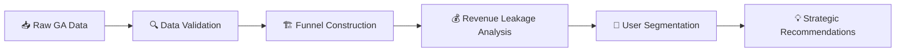

<div align="center">

<p>
  
  
</p>

<h1>🔍 Revenue Leak Detection via Conversion Funnel Optimization</h1>

<p>
  
  
  
  
</p>

<p><em>End-to-End Data Analysis Project: Identifying Revenue Leakage Points in E-commerce Conversion Funnels</em></p>

<table>
  <tr>
    <td><a href="#-key-findings"><strong>Key Findings</strong></a></td>
    <td><a href="#-project-overview"><strong>Overview</strong></a></td>
    <td><a href="#-tech-stack"><strong>Tech Stack</strong></a></td>
    <td><a href="#-folder-structure"><strong>Structure</strong></a></td>
    <td><a href="#-getting-started"><strong>Get Started</strong></a></td>
  </tr>
</table>

</div>

<hr>

## 📊 Key Findings

<table>
  <tr>
    <th align="center" width="25%">Revenue Leakage</th>
    <th align="center" width="25%">Largest Drop-off</th>
    <th align="center" width="25%">Top Segment Leak</th>
    <th align="center" width="25%">Overall Conversion</th>
  </tr>
  <tr>
    <td align="center" width="25%">
      
      <br>
      <strong>$1.14M+</strong>
      <br>
      <sub>Revenue Leakage Identified</sub>
    </td>
    <td align="center" width="25%">
      
      <br>
      <strong>73,961</strong>
      <br>
      <sub>Drop-offs (View → Cart)</sub>
    </td>
    <td align="center" width="25%">
      
      <br>
      <strong>$835K</strong>
      <br>
      <sub>Desktop Revenue Leak</sub>
    </td>
    <td align="center" width="25%">
      
      <br>
      <strong>9.3%</strong>
      <br>
      <sub>Overall Conversion Rate</sub>
    </td>
  </tr>
</table>

<hr>

## 🎯 Project Overview

This project identifies **where revenue is being lost** in an e-commerce conversion funnel and provides **data-driven recommendations** to optimize user journeys and maximize revenue.

### The Business Problem

> *"Why are users viewing products but not completing purchases? Where exactly is the funnel breaking?"*

### The Approach



<hr>

## 📈 Funnel Performance Snapshot

```text
┌─────────────────────────────────────────────────────────────────────────┐
│                          CONVERSION FUNNEL                              │
└─────────────────────────────────────────────────────────────────────────┘

   Product Views          Add to Cart           Checkout            Purchase
  ┌─────────────┐       ┌─────────────┐       ┌──────────┐       ┌──────────┐
  │   124,066   │  ───► │   50,105    │  ───► │  22,389  │  ───► │  11,552  │
  │   sessions  │       │   sessions  │       │ sessions │       │ sessions │
  └─────────────┘       └─────────────┘       └──────────┘       └──────────┘
                  │                     │                  │
                  ▼                     ▼                  ▼
              40.4%                 44.7%              51.6%
           conversion            conversion         conversion

                  ⚠️ LARGEST
                  DROP-OFF
```

<hr>

## 🔴 Critical Revenue Leakage by Stage

| Funnel Stage | Sessions Lost | Revenue Impact | Priority |
|:-------------|:-------------:|:--------------:|:--------:|
| **Product View → Add to Cart** | 73,961 | **$1,141,441** | 🔴 CRITICAL |
| Add to Cart → Checkout | 27,716 | $427,742 | 🟡 Medium |
| Checkout → Purchase | 10,837 | $167,248 | 🟢 Low |

> **💡 Key Insight:** The **Product View → Add to Cart** stage accounts for **~65-70%** of total revenue leakage. Optimizing this stage offers the highest ROI.

<table>
  <tr>
    <td><strong>Executive Priority:</strong> Product View → Add to Cart</td>
    <td><strong>Expected Outcome:</strong> Highest ROI stage optimization</td>
  </tr>
</table>

<hr>

## 💻 Tech Stack

<table>
  <tr>
    <td align="center" width="33%">
      <strong>🔍 Analysis</strong>
      <br><br>
      <code>BigQuery SQL</code>
      <br>
      <code>Python (Pandas)</code>
      <br>
      <code>Jupyter Notebooks</code>
    </td>
    <td align="center" width="33%">
      <strong>📊 Visualization</strong>
      <br><br>
      <code>Tableau</code>
      <br>
      <code>Matplotlib</code>
      <br>
      <code>Seaborn</code>
    </td>
    <td align="center" width="33%">
      <strong>📁 Data Source</strong>
      <br><br>
      <code>Google Analytics</code>
      <br>
      <code>Sample Dataset</code>
      <br>
      <code>366 days coverage</code>
    </td>
  </tr>
</table>

<hr>

## 📁 Folder Structure

```text
📦 Revenue_Leak_Detection/
├── 📂 SQL/
│   ├── 01_data_validation.sql         # ✅ Data quality checks
│   ├── 02_funnel_construction.sql     # 🏗️ Build session-level funnel
│   ├── 03_revenue_leakage.sql         # 💰 Quantify revenue loss
│   └── 04_segmentation_and_recommendations.sql  # 👥 User segmentation
│
├── 📂 notebooks/
│   └── 01_funnel_analysis_validation.ipynb  # 🐍 Python validation
│
├── 📂 Outputs/
│   ├── 📂 query_results/              # 📊 SQL query exports (CSV)
│   └── 📂 Tableau_Outputs/            # 📈 Tableau workbook & data
│
├── 📂 reports/
│   ├── business_recommendation.md     # 💡 Strategic recommendations
│   └── assumption_and_limitations.md  # ⚠️ Analytical caveats
│
└── README.md                          # 📖 You are here!
```

<hr>

## 🎯 Strategic Recommendations

<details>
<summary><strong>1. 🖥️ Optimize Desktop Product Pages (Highest Priority)</strong></summary>

**Why:** Desktop users account for **$835K** in revenue leakage - the largest segment.

**Actions:**
- ✅ Place **Add to Cart CTA above the fold**
- ✅ Improve visual hierarchy (price, CTA, delivery info)
- ✅ Reduce distracting secondary CTAs
- ✅ Optimize product image loading

</details>

<details>
<summary><strong>2. 🛡️ Improve Product Trust & Value Communication (High Priority)</strong></summary>

**Why:** High drop-off before Add to Cart indicates **hesitation**, not rejection.

**Actions:**
- ✅ Surface ratings, reviews, and social proof near CTA
- ✅ Display delivery timelines and return policies earlier
- ✅ Highlight guarantees and certifications

</details>

<details>
<summary><strong>3. 🎯 Align Landing Pages for Direct & Google Traffic (Medium Priority)</strong></summary>

**Why:** Direct and Google traffic together account for **$1M+** in leakage.

**Actions:**
- ✅ Match landing page messaging to search intent
- ✅ Clear value proposition above the fold
- ✅ Avoid routing to generic product pages

</details>

<hr>

## 🚀 Getting Started

### Prerequisites

- 🔐 Google Cloud account with BigQuery access
- 🐍 Python 3.x with Jupyter
- 📊 Tableau Desktop (optional for visualization)

### Quick Start

```bash
# Clone the repository
git clone https://github.com/yourusername/revenue-leak-detection.git

# Open SQL files in BigQuery Console and execute in order:
# 1. 01_data_validation.sql
# 2. 02_funnel_construction.sql
# 3. 03_revenue_leakage.sql
# 4. 04_segmentation_and_recommendations.sql

# For Python validation, launch Jupyter:
jupyter notebook notebooks/01_funnel_analysis_validation.ipynb
```

<hr>

## 📊 Data Overview

| Metric | Value |
|--------|-------|
| **Total Sessions** | 132,403 |
| **Product View Sessions** | 124,066 |
| **Purchase Sessions** | 11,552 |
| **Total Revenue** | $1,782,822 |
| **Revenue per Session** | $13.47 |
| **Date Range** | Aug 2016 - Aug 2017 |

<table>
  <tr>
    <td><strong>Reporting Window:</strong> Aug 2016 - Aug 2017</td>
    <td><strong>Primary KPI:</strong> Revenue per Session</td>
  </tr>
</table>

<hr>

## ⚠️ Assumptions & Limitations

- 📅 Analysis based on **Google Analytics sample dataset** (366 days)
- 💵 Revenue recorded **only at purchase stage**
- 🔄 Funnel steps assumed within **same session**
- 📱 Results represent **directional insights** for optimization

> For full details, see [`reports/assumption_and_limitations.md`](reports/assumption_and_limitations.md)

<hr>

## 📝 License

This project is for educational and portfolio purposes.

<hr>

<div align="center">

### 📬 Let's Connect!

[](https://linkedin.com/in/yourprofile)
[](https://github.com/yourusername)
[](https://yourportfolio.com)

<p><sub>⭐ Star this repository if you found it helpful!</sub></p>

</div>
